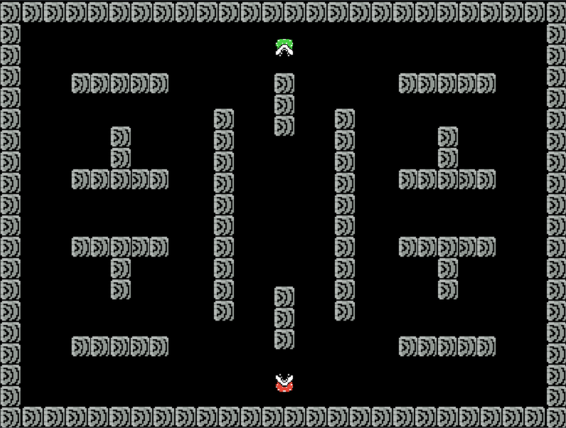

# piranha-plant-duel

A local two-player top-down duel game built with Python and Pygame. Two piranha plants navigate a walled arena, shooting projectiles to knock each other out. I made this in high school as one of my first projects.

<p>
  
</p>

## Features

- Local 2-player competitive gameplay on a single keyboard
- Top-down arena with wall obstacles that block movement and bullets
- Directional movement and shooting (up, down, left, right)
- HP system with 5 hit points per player
- Custom pixel art sprites and retro font

## Installation

### Prerequisites

- Python 3
- Pygame

### Setup

1. Install Pygame:

   ```bash
   pip install pygame-ce
   ```

2. Run the game:
   ```bash
   python "Piranha Game.py"
   ```

## Controls

### Player 1

| Key   | Action       |
| ----- | ------------ |
| W     | Move up      |
| S     | Move down    |
| A     | Move left    |
| D     | Move right   |
| Space | Shoot bullet |

### Player 2

| Key        | Action       |
| ---------- | ------------ |
| Up Arrow   | Move up      |
| Down Arrow | Move down    |
| Left Arrow | Move left    |
| Right Arrow| Move right   |
| Right Ctrl | Shoot bullet |
